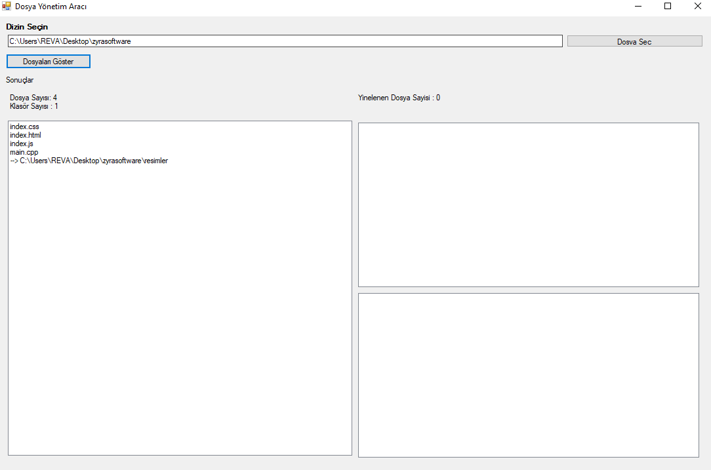

# Dosya Yönetim Aracı

Bu basit dosya yönetim aracı, Windows işletim sistemi üzerinde çalışan bir dosya yöneticisidir. Aşağıda aracın temel özelliklerini bulabilirsiniz.

## Özellikler

- **Dosya Gezgini:** Dosyalarınızı görüntüler ve bir dosya seçtirir.
- **Dosya Klasör Sayısı Gösterme**: Seçtiğiniz dosyada ne kadar klasör var, veya ne kadar dosya var gösterir..
- **Yenilenen Dosya Sayısını Gösterme**: Kısa süre önce yenilenen/düzenlenen dosyaları gösterir.

## Nasıl Kullanılır

1. Aracı başlatın.
2. Dosya Gezgini bölümünden dosyalarınıza göz atın.
3. Detaylı görmek istediğiniz dosyayı seçin.
4. Dosyayı Seç butonuna tıklayın.

## Gereksinimler

- Windows işletim sistemi
- .NET Framework yüklü olmalıdır


## Kurulum

1. Bu depoyu bilgisayarınıza klonlayın.
   ```bash
   git clone https://github.com/Emirkksl/cpp-yonetim-arac-


# Geliştirme
| Herkese Açık | Geliştirilebilir |
| -------- | -------- |
| Açık   | Geliştirilebilir |

*Bu, geliştirmeye açık bir projedir. Geliştirilebilir ve üstüne ek özellikler eklenebilir.*

# Ekran Resmi


